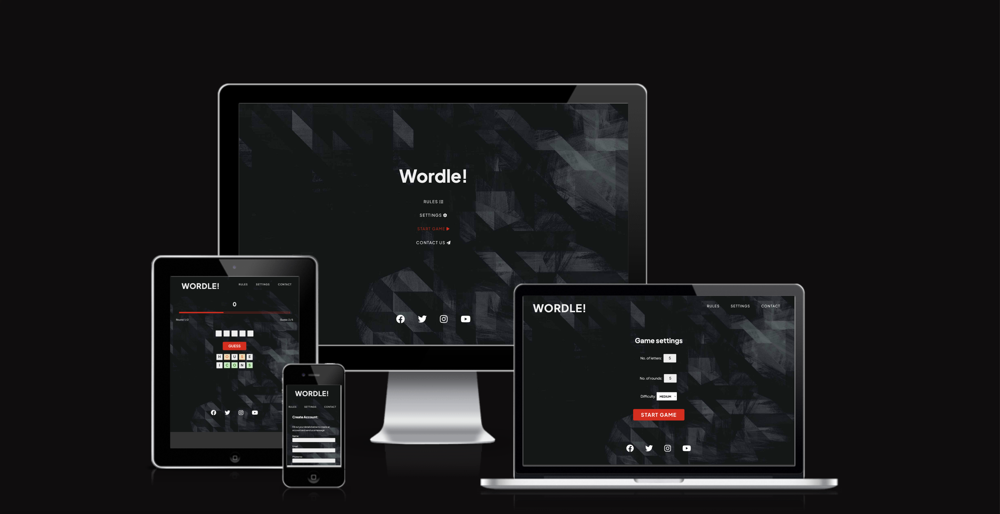
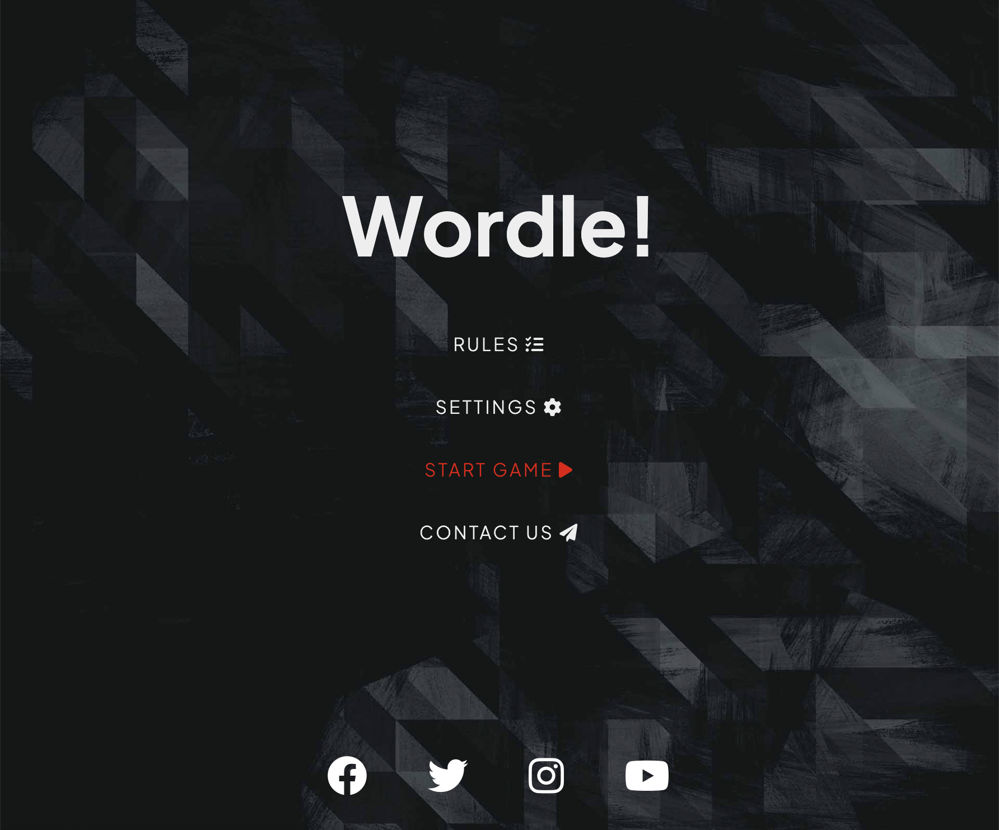
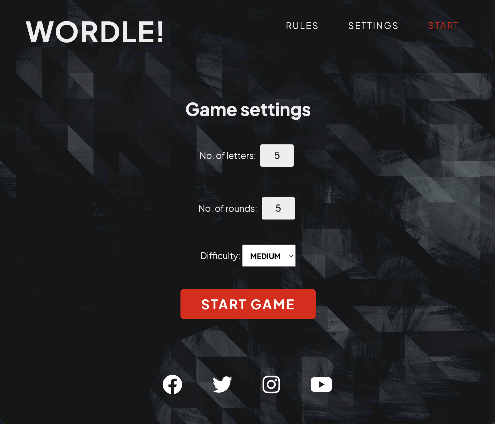
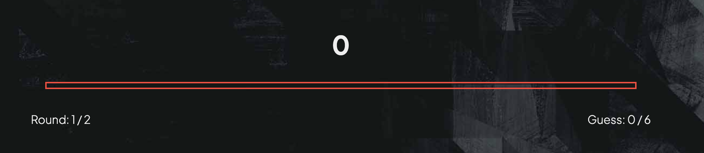
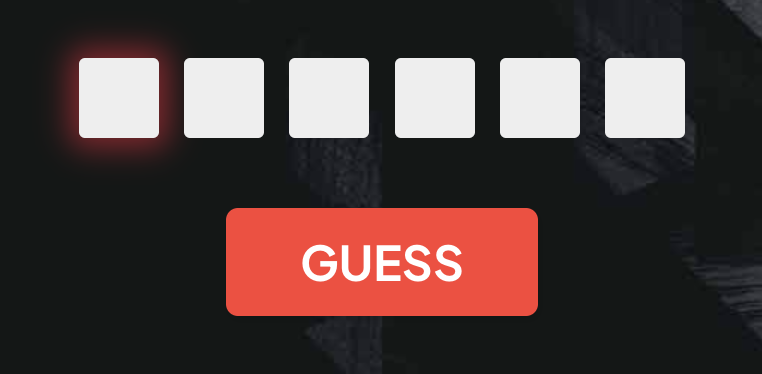
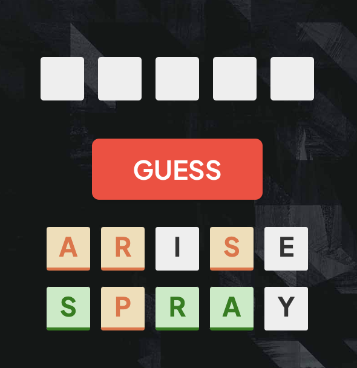
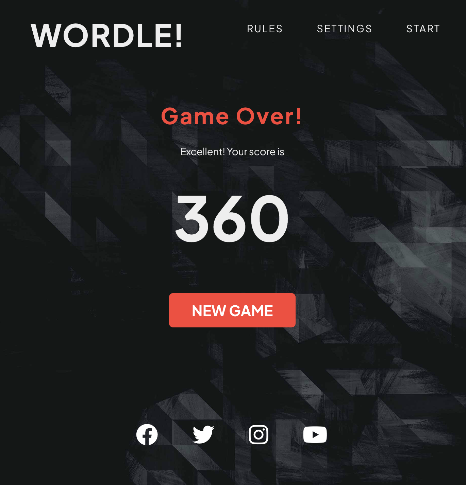
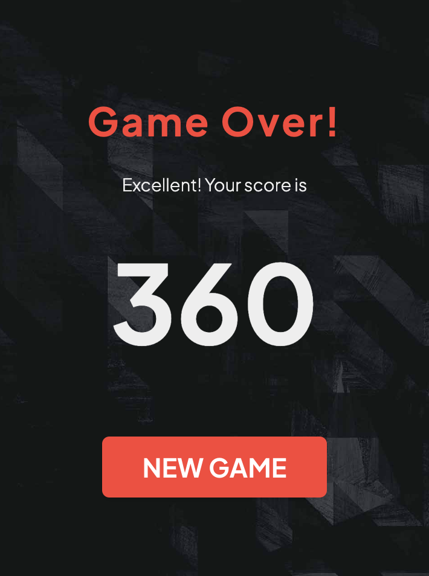

# Wordle Clone
(Developer: John Constant)

[Live webpage](https://johnconstant.github.io/CI_PP2_wordle_clone/)

## Table of Content

1. [Project Goals](#project-goals)
    1. [User Goals](#user-goals)
    2. [Site Owner Goals](#site-owner-goals)
2. [User Experience](#user-experience)
    1. [Target Audience](#target-audience)
    2. [User Requirements and Expectations](#user-requirements-and-expectations)
    3. [User Stories](#user-stories)
    4. [Site Owner Stories](#site-owner-stories)
3. [Design](#design)
    1. [Design Choices](#design-choices)
    2. [Colour](#colours)
    3. [Fonts](#fonts)
    4. [Structure](#structure)
    5. [Wireframes](#wireframes)
4. [Technologies Used](#technologies-used)
    1. [Languages](#languages)
    2. [Frameworks & Tools](#frameworks-&-tools)
5. [Features](#features)
6. [Testing](#validation)
    1. [HTML Validation](#HTML-validation)
    2. [CSS Validation](#CSS-validation)
    3. [JavaScript Validation](#javascript-validation)
    4. [Accessibility](#accessibility)
    5. [Performance](#performance)
    6. [Device testing](#performing-tests-on-various-devices)
    7. [Browser compatibility](#browser-compatability)
    8. [Testing user stories](#testing-user-stories)
8. [Bugs](#Bugs)
9. [Deployment](#deployment)
    1. [EmailJS API](#emailjs-api)
10. [Credits](#credits)
11. [Acknowledgments](#acknowledgments)

## Project Goals 
The Wordle clone is a copy of the popular New York Times word game. This version of the game allows the use to choose the number of letters in the word, the number of words per game and the number of guesses per word.

### User Goals
- Play a fun and engaging word guessing game
- Learn new words and their meanings

### Site Owner Goals
- Creating a fun and interactive game that users will want to play again and again.
- The game should be fully responsive to be able to be played on different devices.

## User Experience

### Target Audience
- casual gamers
- people who like word games
- people who love the existing word game and want play more of it

### User Requirements and Expectations
- A simple and intuitive navigation system
- Quick, easy, and fun to play
- Links and functions that work as expected
- Good presentation and a visually appealing design regardless of screen size
- An easy way to leave feedback
- Accessibility

### User Stories
1. As a user, I want to be able to pick the settings for the game
2. As a user, I want to learn the rules of the game
3. As a user, I want to gain feedback on my previous guesses in the game
4. As a user, I want to get visual feedback about my games progress
5. As a user, I want to know what the correct phrase was in case I don't guess it correctly
6. As a user, I want to see the definition of the correct answer
7. As a user, I want feedback on my correct answers
8. As a user, I want to see my total score at the end of the game
9. As a user, I want to use contact form and leave a message

### Site Owner Stories
10. As a site owner, I want users to be able to contact us and leave a message.
11. As a site owner, I want users to be able to find us on social media.

## Design

### Design Choices
The game was designed to have a simple design with highly contrasting, simple colours. 

### Colour
A similar colour palette was chosen to the original New York Times version of the game. The yellow and green colours giving users feedback on their guesses are intuitive and the red colour is a highly contrasting colour to these.

### Fonts
For the fonts, I decided to use a clean, crisp sans-serif font. I used Google Fonts ['Jakarta Plus'](https://fonts.google.com/specimen/Plus+Jakarta+Sans) font. 

### Structure
The page is structured in a user-friendly and easy-to-learn way. Upon arriving at the website the user sees a screen with a menu listing some of the pages. The site contains of 6 pages. 

- A home page with menu
- A game page with 4 different views:
    - one for the game
    - one for the game with user guesses
    - one for round over message
        - Correct answer
        - Wrong answer
    - one with game over message
- A game rules page
- A game settings page
- A contact form
- A 404 page

### Wireframes

Start screen

Game screen

Correct screen

Game over screen

Contact Us

Form confirmation

404 page

## Technologies Used

### Languages
- HTML
- CSS
- JavaScript

### Frameworks & Tools
- Git
- GitHub
- Gitpod
- Balsamiq
- Font Awesome
- Favicon.io
- JSHint
- Lighthouse
- W3C Markup validation service
- W3C Jigsaw CSS validation service 
- WAVE WebAIM web accessibility evaluation tool
- Random Word API
- Dictionary API
- EmailJS

## Features
The site consists of six pages and nine features

### Header
- Featured on all pages except the home page
- Consists of the game logo and nav menu

Header

### Footer
- Featured on all pages
- Consists of a section providing social media links
- User story covered: 11

Footer

### Start screen
- Provides an easy to use navigation to the various different pages on the website.
- User story covered: 1, 2, 9, 11

Start screen

### Settings screen
- Allows the player to choose their game options
    - Set the number of letters in their word from 4 to 8
    - Choose the number of rounds per game from 1 to 10
    - Set the difficulty and change the number of guesses available
    - User stories covered: 1

Settings screen

### Game screen
- Consists of different sections:
    - Current game score
    - Remaining guesses progress bar
    - Round and guess counters
    - Text inputs for players guess
    - Submit button
    - Validation error message
    - Player's previous guesses
    - User stories covered: 3, 4, 8

Game screen - user interface

Game screen - text inputs

Game screen - form validation

Game screen - previous guess

### End of round screen
- Consists of four sections
    - A dynamic message depending on the result of the round
    - A section with the current score after the round
    - The correct answer in the round
    - a sound effect for added feedback if the answer is correct
    - A definition of the correct answer as it appears on dictionary API
    - A summary of the player's guesses from the round
    - User story covered: 3, 4, 5, 6, 7

Correct Guess screen

Out of guesses screen

No definition found screen

### Game over screen
- Consists of three sections
    - A section with the current score
    - The game over message with dynamic content determined by the player score
    - Buttons to chose what to do next
    - User stories covered: 4, 8

Game Over Screen

Game Over - low score

Game Over - medium score

Game Over - high score

### Contact form
- A way for the user to provide feedback
- User story covered: 9

Contact Form

### Form confirmation
- Provides the user with feedback after the form has been submitted and a button to return to the game
- User story covered: 6

Form confirmation

### 404 message
- Provides the user with a way to return to the game after clicking on a broken link

404 message

## Validation

### HTML Validation
The W3C Markup Validation Service was used to validate the HTML of the website. All pages pass with no errors no warnings to show.

Home

Game Page

Settings

Rules

Contact Us

404

### CSS Validation
The W3C Jigsaw CSS Validation Service was used to validate the CSS of the website. When validating the CSS it passes with no errors.

Full page

### JavaScript Validation
JSHint Static Code Analysis Tool for JavaScript was used to validate the Javascript files. No significant issues were found.

index.js

settings.js

contact.js

### Accessibility
The WAVE WebAIM web accessibility evaluation tool was used to ensure the website met high accessibility standards. All pages pass with 0 errors.

Home

Game

Settings

Rules

Contact

404

### Performance 
Google Lighthouse in Google Chrome Developer Tools was used to test the performance of the website.

Home

Game

Settings

Rules

Contact

404

### Performing tests on various devices 
The website was tested on the following devices:

- Lenovo Yoga 2 Pro (both in pc and tablet mode)
- Honor 20 pro
- Xiaomi Redmi Note 7

In addition, the website was tested using the Google Chrome Developer Tools Device Toggling option for all available device options.

### Browser Compatability
The website was tested on the following browsers:

- Google Chrome
- Mozilla Firefox
- Microsoft Edge

### Testing user stories

1. As a user, I want to be able to pick the settings for the game

| **Feature** | **Action** | **Expected Result** | **Actual Result** |
|-------------|------------|---------------------|-------------------|
| Settings screen | Choose your desired game settings | The games screen loads with the desired settings | Works as expected |

Screenshots

2.  As a user, I want to learn the rules of the game

| **Feature** | **Action** | **Expected Result** | **Actual Result** |
|-------------|------------|---------------------|-------------------|
| Rules page | Click rules button in the header navigation | Read the rules of the game and some helpful tips and tricks  | Works as expected |

Screenshots

3. As a user, I want to gain feedback on my previous guesses in the game

| **Feature** | **Action** | **Expected Result** | **Actual Result** |
|-------------|------------|---------------------|-------------------|
| Game screen | Submit a guess using the text inputs on screen | The letters that appear in the correct answer are highlighted depending on their position | Works as expected |

Screenshots

4. As a user, I want to get visual feedback about my games progress

| **Feature** | **Action** | **Expected Result** | **Actual Result** |
|-------------|------------|---------------------|-------------------|
| Game screen | Play the game making guesses and progressing through rounds | The progress bar, guess counter and round counter update | Works as expected |

Screenshots

5. As a user, I want to know what the correct phrase was in case I don't guess it correctly

| **Feature** | **Action** | **Expected Result** | **Actual Result** |
|-------------|------------|---------------------|-------------------|
| End of round screen | Don't complete the phrase before you run out of guesses | The correct answer is displayed | works as expected |

Screenshots

6. As a user, I want to see the definition of the correct answer

| **Feature** | **Action** | **Expected Result** | **Actual Result** |
|-------------|------------|---------------------|-------------------|
| End of round screen | Don't complete the phrase before you run out of guesses | The correct answer is displayed | works as expected |
| End of round screen | Guess the correct answer | The definition of the correct answer is displayed from dictionary API | works as expected | 

Screenshots

7. As a user, I want feedback on my correct answers

| **Feature** | **Action** | **Expected Result** | **Actual Result** |
|-------------|------------|---------------------|-------------------|
| End of round screen | Guess the correct answer | Sound effect plays for added feedback | Works as expected |

Screenshots

8. As a user, I want to see my total score at the end of the game

| **Feature** | **Action** | **Expected Result** | **Actual Result** |
|-------------|------------|---------------------|-------------------|
| Game Over screen | Finish a game | See the final score for the game with a dynamic message | Works as expected |

Screenshots

9. As a user, I want to use contact form and leave a message

| **Feature** | **Action** | **Expected Result** | **Actual Result** |
|-------------|------------|---------------------|-------------------|
| Form confirmation | Fill out the contact form and click the submit button | A thank you message is displayed | Works as expected | 
| User email | Fill out the contact form and click the submit button | An email with the submitted content is received by the player | Works as expected | 

Screenshots

10. As a site owner, I want users to be able to contact us and leave a message.

| **Feature** | **Action** | **Expected Result** | **Actual Result** |
|-------------|------------|---------------------|-------------------|
| Contact form | Click on the contact link in the header navigation | Displays the contact form | Works as expected |

Screenshots

11. As a site owner, I want users to be able to find us on social media.

| **Feature** | **Action** | **Expected Result** | **Actual Result** |
|-------------|------------|---------------------|-------------------|
| Footer | Scroll down to the footer section | See social media links | Works as expected |

Screenshots

## Bugs

| **Bug** | **Fix** |
| ----------- | ----------- |

## Deployment
The website was deployed using GitHub Pages by following these steps:
1. In the GitHub repository navigate to the Settings tab
2. On the left-hand menu select Pages
3. For the source select Branch: master
4. After the webpage refreshes automatically you will ses a ribbon on the top saying: "Your site is published at https://4n4ru.github.io/CI-P2-GuessingBee/

You can fork the repository by following these steps:
1. Go to the GitHub repository
2. Click on Fork button in the upper right hand corner

You can clone the repository by following these steps:
1. Go to the GitHub repository 
2. Locate the Code button above the list of files and click it 
3. Select if you prefer to clone using HTTPS, SSH, or Github CLI and click the copy button to copy the URL to your clipboard
4. Open Git Bash
5. Change the current working directory to the one where you want the cloned directory
6. Type git clone and paste the URL from the clipboard ($ git clone https://github.com/YOUR-USERNAME/YOUR-REPOSITORY)
7.Press Enter to create your local clone.

### EmailJS API
1. Create an account at emailjs.com
2. Add new email service, make note of the contact_service id
3. Add a new email template, make note of the contact_form id
4. Go the the integration dashboard, make note of your user id
5. Load the EmailJS SDK in the head of your HTML file
6. In JavaScript create a function that listens to a submit event and then initializes the SDK with your user id (emailjs.init('YOUR_USER_ID');) and submits the form (emailjs.sendForm('contact_service', 'contact_form', this);)

## Credits

### Media
- [Sound Effect]('assets/sounds/correct_soundEffect.mp3'): <a href='https://www.dreamstime.com/royalty-free-sound-fx-correct-ding-correct-answer-ding-designed-games-apps-audio137523215'>Correct answer ding</a>

### Code

## Acknowledgments
I would like to take the opportunity to thank:
- My mentor Mo Shami for his feedback, advice, guidance and support.
